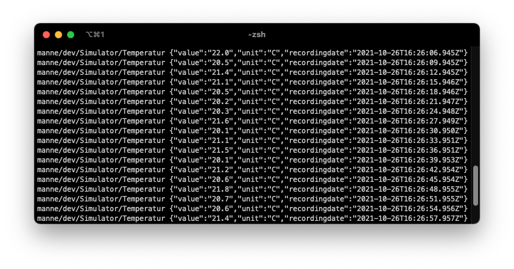

# Sensor Simulator


Generate multiple MQTT publishes in several topics. In this case i Simulate a DHT 22 for an Arduino ans push the temperature and the humidity to the MQTT Broker.

* **JS modules**.
* Create a real simulator of every sencor you want.
* **Modular** to fit different use cases: big IoT applications
  or even small tests for api or something else.
* Pushes the data in a JSON format and add a timestamp to every measurement. 

<p align="center">
  
</p>


## How It Works

1. This application contains several node packages. In this project are two packages used: mqtt, moment
2. Edit the configurations to the measurements and topics you need. See the part below.
3. The appication generate random values in a specific range. After it will build the topic to be pusblished on. 


## Usage

### JS Applications

It's very easy to use this simulator for every of your projects.

1. Download and run the project:

    ```sh
    $ git clone 'repo'
    $ cd 'repo'
    $ npm install
    $ node simulator.js
    ```


## Config

Size Limits supports three ways to define config.

1. The genreal MQTT Config

   ```js
    const connectoptions = {
    cmd: 'connect',
    protocolId: 'MQTT', 
    protocolVersion: 4, 
    clientId: 'Simulator',
    clean: true,
    keepalive: 10, 
    port: 1883,
    will:
        {
            topic: 'your/crazy/Topic/',
            payload: new Buffer('offline'), // Payloads are buffers
        },

   ```

2. Build the topic path

   ```js
   const homeTopic = 'your/crazy/'
   const anlage = 'topic/'

   const topicTemp = homeTopic + anlage + 'Temperatur'
   const topicLuft = homeTopic + anlage + 'Luftfeuchtigkeit'
   ```

3. The publish:

   ```js
      client.publish(topicTemp, JSON.stringify(temp, null, 0), { qos: 0, retain: false, dup: false })
   ```

